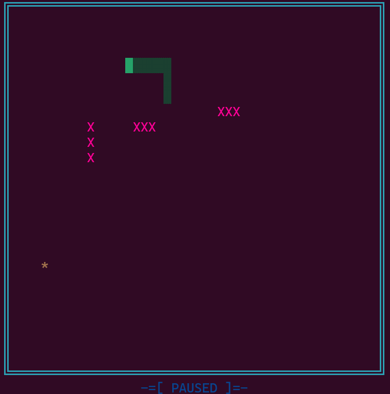

# 🐍 Terminal Snake

A classic Snake game that runs directly in your terminal, built in C.

## 🎮 Gameplay



## 🛠️ Installation
```bash
git clone https://github.com/mucelep/Terminal_Snake.git
cd Terminal_Snake
make
```

## ▶️ How to Play
```bash
 make
./snake
```

## 🕹️ Controls

| Key | Action |
|-----|--------|
| W | Move Up |
| A | Move Left |
| S | Move Down |
| D | Move Right |
| P | Pause / Resume |
| Q | Quit |

## 🎯 Game Modes

### Easy Mode
- Snake passes through walls and comes out the other side
- Only danger is biting yourself

### Hard Mode
- Hitting a wall kills you
- Obstacles appear after eating food
- Speed increases as you eat more food

## 🏆 Scoring

- Each food eaten = +1 point
- High score is saved automatically to `score.txt`

---

# 🐍 Terminal Snake (Türkçe)

Terminalde çalışan klasik Yılan oyunu, C ile yazılmıştır.

## 🛠️ Kurulum
```bash
git clone https://github.com/mucelep/Terminal_Snake.git
cd Terminal_Snake
make
```

## ▶️ Nasıl Oynanır
```bash
./snake
```

## 🕹️ Kontroller

| Tuş | Hareket |
|-----|---------|
| W | Yukarı |
| A | Sola |
| S | Aşağı |
| D | Sağa |
| P | Duraklat / Devam Et |
| Q | Çıkış |

## 🎯 Oyun Modları

### Kolay Mod
- Yılan duvara çarpınca karşı taraftan çıkar
- Tek tehlike kendine çarpmak

### Zor Mod
- Duvara çarpınca ölürsün
- Yem yedikçe engeller belirir
- Yem yedikçe hız artar

## 🏆 Skor

- Her yem = +1 puan
- En yüksek skor otomatik olarak `score.txt` dosyasına kaydedilir
